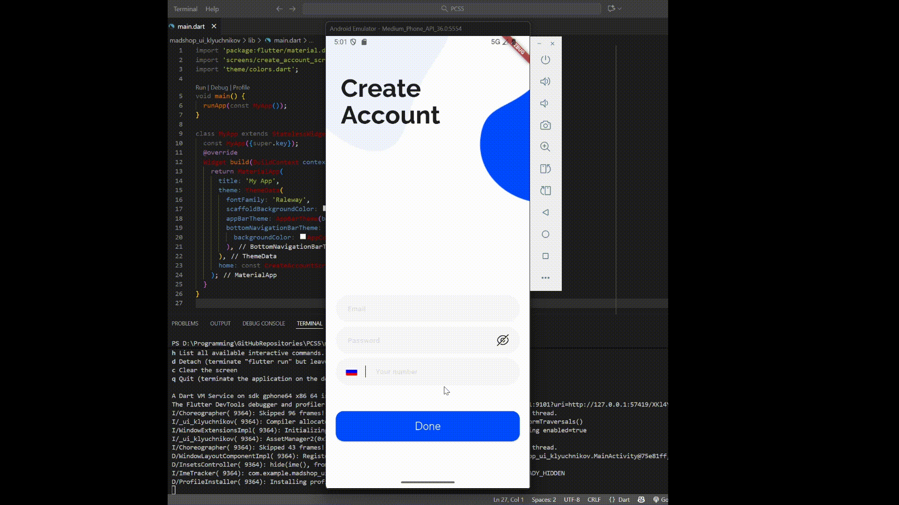

# Программирование корпоративных систем - практика 6
## Подготовил Ключников А.Д., ЭФБО-09-23

### Цели:
-	Освоить процесс переноса готового дизайна из Figma в Flutter.
-	Изучить принципы адаптивной верстки мобильного интерфейса.
-	Научиться использовать стили, отступы и компоненты в соответствии с UI-гайдом.
-	Сверстать основные экраны мобильного приложения на основе предоставленного макета MAD Shopp Mobile App Design.
-	Получить навыки настройки навигации между экранами.

### Скриншоты экранов программы:

* Экран "Create Account"

* Экран "Login"

* Экран "Hello!"

* Экран "Shop (home)"

* Экран "Favourites"

* Экран "Cart"

### Демонстрация работы программы:

